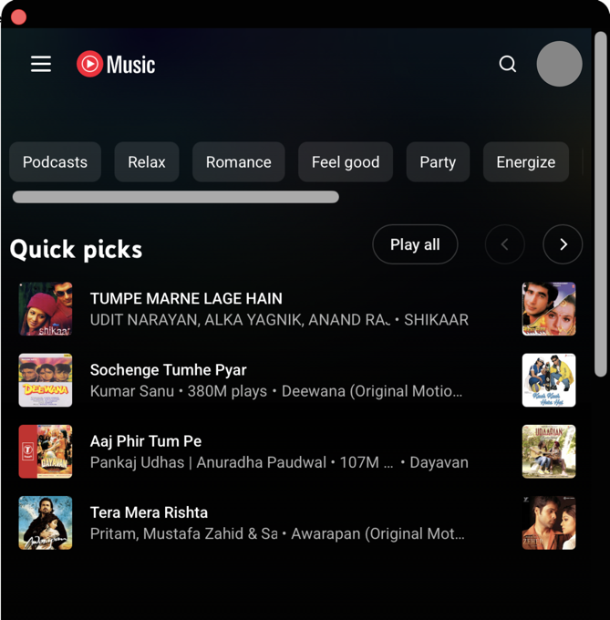
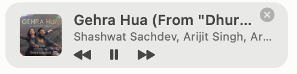

# Express YT Music

**Control YouTube Music from your Mac's menu bar.**

No more hunting for the right browser tab to skip a song. Express YT Music puts YouTube Music
in a small window that drops down from your menu bar, plus an optional floating mini player
that stays on top while you work.

  

   
  <em>Optionally shows what's playing right in the menu bar — click the note to open the player</em>

   
  <em>The mini player floats above your other windows, so you can see and change what's playing</em>

## Download

**[⬇ Download Express YT Music 1.5.0](../../raw/master/download/Express-YT-Music-1.5.0.dmg)** — 715 KB,
works on Apple Silicon and Intel Macs, macOS 13 (Ventura) or later.

Then:

1. Open the downloaded `.dmg` and drag **Express YT Music** into your **Applications** folder.
2. **Right-click** the app and choose **Open** (this first time only — see below).
3. A small music note appears in your menu bar. Click it and sign in to YouTube Music.

### "Apple could not verify this app" — what to do

The first time you open it, macOS will warn you. This is expected and it is not a sign that
something is wrong: Apple charges a yearly developer fee to have apps "notarised", and this is a
free hobby project without one. macOS shows the same warning for every app that hasn't paid.

To get past it, either:

- **Right-click** (or Control-click) the app icon → **Open** → **Open** again, or
- open it normally, then go to **System Settings → Privacy & Security**, scroll down and click
  **Open Anyway**.

You only have to do this once. If you would rather not trust a stranger's binary at all — a
completely reasonable position — you can [build it yourself from the source](DEVELOPERS.md) in
about ten seconds.

## What it does

| | |
| --- | --- |
| 🎵 **Menu bar player** | Click the note in your menu bar and YouTube Music drops down. Click away and it hides. |
| ⏭ **Skip without switching apps** | A Next button sits right in the menu bar. One click, no window needed. |
| 🪟 **Floating mini player** | A small always-on-top window showing the cover art, song and controls. |
| 🎹 **Works with your keyboard's media keys** | Play, pause and skip using the keys you already use. |
| ⌨️ **Your own shortcuts** | Set global hotkeys for play/pause, next, previous and show/hide. |
| 🎧 **Shows up where macOS expects** | Song and cover art appear in Control Centre, on the lock screen, and your AirPods controls work. |
| 🚀 **Starts with your Mac** | Optional — turn it on from the menu. |
| 🪶 **Tiny and quiet** | Under 1 MB. No ads of its own, no accounts, no tracking. |

## Why you might like it

- **You keep losing the music tab.** It's always one click away in the menu bar instead of buried
  among thirty browser tabs.
- **You want to see what's playing.** The mini player sits above your work, so you don't have to
  switch apps to check or skip.
- **You want your media keys to work.** Browser tabs are unreliable about this; a real app isn't.
- **You don't want a heavy app.** Many similar apps bundle an entire copy of Chrome and weigh
  200–500 MB. This one is 715 KB because it uses the browser engine already built into your Mac.
- **You care what software does behind your back.** This app makes no network connections of its
  own — the only thing it ever talks to is YouTube itself. There is no analytics, no telemetry,
  no auto-updater, and it never touches Safari's or Chrome's saved logins. Every line is here to
  read.

## What you need

- A Mac running **macOS 13 (Ventura)** or newer
- A **YouTube Music account** — this app is a nicer window onto YouTube Music, not a music
  service. Free accounts work; if you don't have YouTube Premium you'll hear YouTube's usual ads,
  exactly as you would in a browser.

## Everyday use

| To do this | Do that |
| --- | --- |
| Open or close the player | Click the music note in the menu bar |
| See the menu of options | **Right-click** the music note |
| Skip a track | Click the arrow in the menu bar, or press ⌃⌥⌘→ |
| Play / pause | Your keyboard's play key, or ⌃⌥⌘P |
| Show the mini player | Right-click the note → **Show Mini Player** |
| Move the mini player | Drag it anywhere by its background |
| Stop it floating on top | Right-click it → untick **Keep on Top** |
| Show the song name in the menu bar | Right-click the note → **Show Track Title in Menu Bar** |
| Change the shortcuts | Right-click the note → **Keyboard Shortcuts…** |
| Sign out | Right-click the note → **Sign Out of YouTube Music** |
| Quit | Right-click the note → **Quit** |

## Good to know

I built this for my own use. If it turns out to be useful to you too, help yourself — with a few
things worth knowing:

- It was **built with the help of [Claude](https://claude.ai/code)**, Anthropic's AI assistant.
- It comes with **no warranty and no support**, and is provided **as is** — use it at your own
  risk. See the [MIT licence](LICENSE) for the formal version.
- It is **not on the Mac App Store** and is **not notarised by Apple**, which is why you'll see
  the security warning above.
- It works by loading the ordinary YouTube Music website and reading what's on screen. **If Google
  redesigns their site, parts of this app may stop working** until the code is updated. That is
  the nature of the approach.
- It is **not affiliated with, endorsed by, or sponsored by Google**. YouTube, YouTube Music and
  their logos are trademarks of Google LLC. This app does not download music, remove ads, or work
  around anything — you sign in with your own account and it behaves like the website does. Your
  use of YouTube Music remains subject to
  [YouTube's Terms of Service](https://www.youtube.com/t/terms).
- Your YouTube session is stored **only on your own Mac**, in this app's private storage. Nothing
  is sent anywhere except to YouTube. "Sign Out" erases it.

If something breaks, the app writes a plain-text log to
`~/Library/Logs/ExpressYTMusic.log` (right-click the menu bar note → **Open Diagnostics Log**),
which is helpful if you want to report a problem.

## For developers

Curious how a Mac app fits in under 1 MB, or want to change something?
**[Read the developer guide →](DEVELOPERS.md)** It covers the tech stack, the folder layout, how
the app talks to the YouTube Music page, the design decisions, and how to build and test it.

Short version: Swift + AppKit, a `WKWebView` running the YouTube Music site, and a small
JavaScript bridge injected into the page. No Xcode project, no dependencies — `make install`.

## Licence

[MIT](LICENSE) — do what you like with it.
